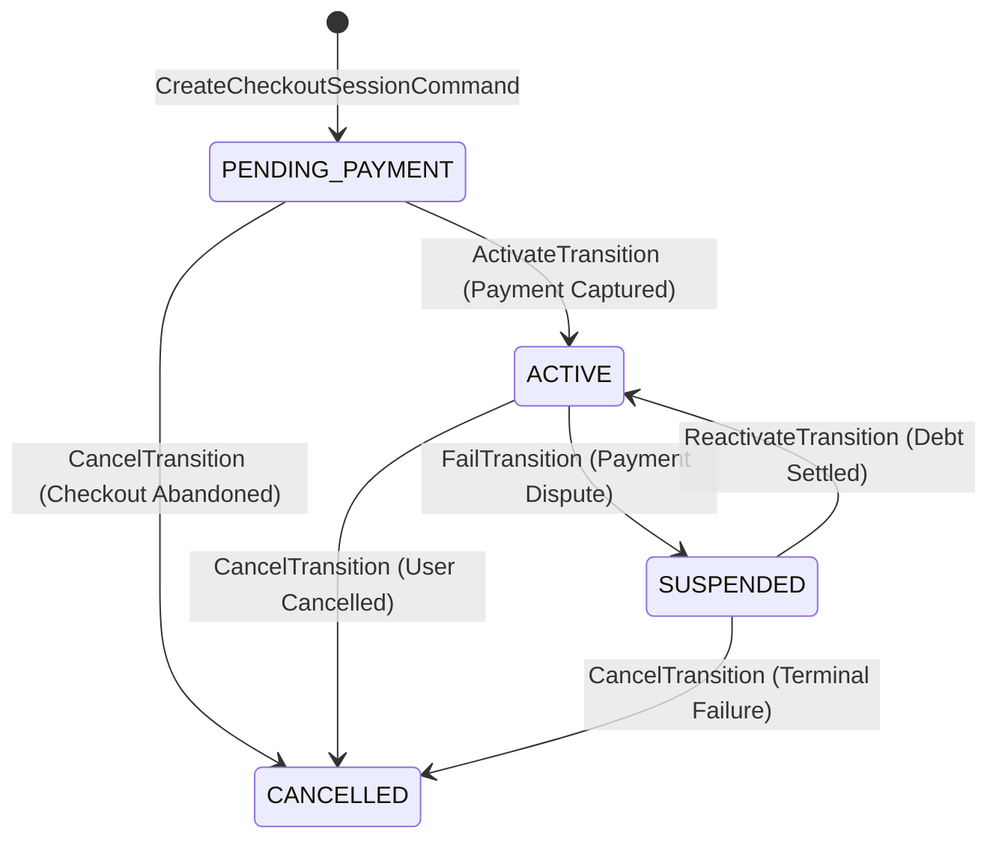
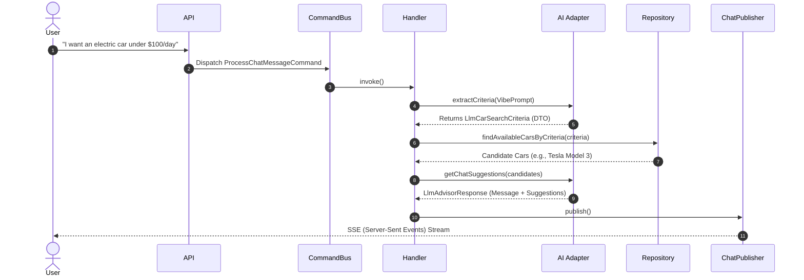

# DriveAgency 🚘

[](https://www.php.net/)
[](https://symfony.com/)
[](https://react.dev/)
[](https://www.typescriptlang.org/)
[](https://www.postgresql.org/)

DriveAgency is a modern, enterprise-grade car subscription platform. It demonstrates advanced architectural patterns and engineering practices, bridging complex backend domain logic with a highly responsive frontend.

The system is designed to handle complex workflows—such as concurrency control during vehicle bookings, AI-driven advisory chats, and strict subscription lifecycle state machines—while remaining maintainable, testable, and highly decoupled.

---

## 📑 Table of Contents
1. [Core Philosophy](#-core-philosophy)
2. [Architecture & Patterns](#-architecture--patterns)
3. [Domain Modules (Bounded Contexts)](#-domain-modules-bounded-contexts)
4. [Deep Dives](#-deep-dives)
   - [Subscription State Machine](#subscription-state-machine)
   - [AI Fleet Advisor (Vibe Search)](#ai-fleet-advisor-vibe-search)
   - [Event-Driven Audit Logging](#event-driven-audit-logging)
5. [Directory Structure](#-directory-structure)
6. [Getting Started (Developer Setup)](#-getting-started-developer-setup)
7. [API Documentation](#-api-documentation)

---

## 🧠 Core Philosophy

We chose a **Modular Monolith** architecture. While microservices offer independent deployment, they often introduce premature operational complexity (network latency, distributed transactions, complex orchestration). A Modular Monolith gives us the best of both worlds: 
- **Strict Domain Boundaries**: Modules cannot access each other's databases or internal implementations.
- **Low Operational Overhead**: Deployed as a single scalable unit via FrankenPHP.
- **Future-Proof**: Because bounded contexts only communicate via isolated APIs, Commands, Queries, and Domain Events, extracting a module into a standalone microservice later requires minimal refactoring.

---

## 🏗️ Architecture & Patterns

The backend strictly adheres to **Clean Architecture** principles:

* **CQRS (Command Query Responsibility Segregation)**: 
  * *Writes (Commands)* encapsulate intent and mutate state via the Command Bus.
  * *Reads (Queries)* bypass the domain layer completely, mapping database rows directly to highly optimized Read-Model DTOs via the Query Bus.
* **Ports & Adapters (Hexagonal Architecture)**: Core business rules (Domain Layer) have zero dependencies on infrastructure (ORM, APIs, external libraries). Communication happens through abstract Ports (Interfaces) implemented by Adapters in the Infrastructure layer.
* **Rich Domain Model & Aggregate Roots**: Entities are not mere data bags (anemic models); they protect their invariants. State changes happen via explicit domain methods.
* **Concurrency Control**: Pessimistic write locks (`PESSIMISTIC_WRITE`) are utilized during critical checkout phases to prevent vehicle double-booking under high load.

```mermaid
graph TD
    subgraph Presentation Layer
        React[React/Vite Frontend]
        API[REST API / Controllers]
        Swagger[Nelmio OpenAPI Docs]
    end

    subgraph Application Boundary (Symfony Messenger)
        CommandBus[Command Bus]
        QueryBus[Query Bus]
        EventBus[Event Bus]
    end

    subgraph Domain Modules (Isolated Bounded Contexts)
        direction TB
        User[User Context]
        Car[Car Context]
        Sub[Subscription Context]
        Audit[AuditLog Context]
    end

    subgraph Infrastructure Adapters
        Doctrine[Doctrine ORM]
        Redis[Redis Storage]
        Stripe[Stripe Client]
        LLM[Symfony AI Platform]
    end

    React -->|JSON| API
    API -->|Dispatches| CommandBus
    API -->|Dispatches| QueryBus
    
    CommandBus --> User & Car & Sub & Audit
    QueryBus --> User & Car & Sub & Audit
    User & Car & Sub & Audit -- "Publishes" --> EventBus

    User & Car & Sub & Audit -.->|Implements Ports| Doctrine & Redis & Stripe & LLM
```

---

## 📦 Domain Modules (Bounded Contexts)

1. **User Module**: Handles authentication (LexikJWT), authorization, and user profiles.
2. **Car Module**: Manages the fleet inventory, availability, and the AI-driven natural language search (Vibe Search).
3. **Subscription Module**: Manages the complex lifecycle of car rentals, handling Stripe payment webhooks, billing cycles, and status transitions.
4. **AuditLog Module**: An isolated observer context that listens to domain events from other modules and durably records them for compliance and history tracking.

---

## 🔍 Deep Dives

### Subscription State Machine
To guarantee that subscription states (e.g., Active, Suspended, Cancelled) cannot be bypassed or corrupted, the `Subscription` aggregate root uses explicit Transition classes. 


*Transitions implement `SubscriptionTransitionInterface`. Invalid attempts throw an `IllegalTransitionException` before any database flush occurs.*

### AI Fleet Advisor (Vibe Search)
The Car module leverages LLMs (DeepSeek/OpenAI via Symfony AI) to parse natural language queries into strict search criteria.



### Event-Driven Audit Logging
When an Aggregate Root (like a User or Subscription) undergoes a significant state change, it records a Domain Event. After the transaction commits, these events (implementing `AuditableEventInterface`) are dispatched. The **AuditLog** module listens to these events entirely asynchronously, completely decoupling the core transaction from the auditing requirement.

---

## 📁 Directory Structure

Our architecture enforces isolation by defining standard layers inside every module.

```text
src/
├── Shared/                   # Shared Domain Kernel (ValueObjects, Event Interfaces)
└── {ModuleName}/             # e.g., Car, Subscription, User
    ├── Api/                  # Ports: HTTP Controllers, Serializers, DTO Requests
    ├── Application/          # Use Cases: Commands, Queries, Handlers, App Interfaces
    ├── Domain/               # Core: Entities, Value Objects, Domain Events, Exceptions
    ├── Infrastructure/       # Adapters: Doctrine Repositories, Stripe, AI Integrations
    └── Tests/                # Isolated Unit, Integration, and Functional Tests
```

---

## 🚀 Getting Started (Developer Setup)

### Prerequisites
* Docker & Docker Compose
* Node.js (v20+) & npm

### Backend Setup
1. **Boot the infrastructure** (FrankenPHP, PostgreSQL, Redis):
   ```bash
   docker compose up -d --build
   ```
2. **Generate JWT keys** for authentication:
   ```bash
   docker compose exec php bin/console lexik:jwt:generate-keypair --skip-if-exists
   ```
3. **Run database migrations & load dummy data** (Creates test users and vehicles):
   ```bash
   docker compose exec php bin/console doctrine:migrations:migrate --no-interaction
   docker compose exec php bin/console doctrine:fixtures:load --no-interaction
   ```
4. **Run the test suite** (100% Coverage on core paths):
   ```bash
   docker compose exec php bin/phpunit
   ```

### Frontend Setup
```bash
cd frontend
npm install --legacy-peer-deps
npm run dev
```
Access the application at `http://localhost:5173/`.

---

## 📖 API Documentation

The REST API is documented using OpenAPI (Swagger). Once the backend is running, access the interactive API documentation at:
**`http://localhost/api/doc`**

*You can authenticate via the `/api/login` endpoint using the credentials generated by the fixtures:*
* **User**: `user@driveagency.com` / `userpassword`
* **Admin**: `admin@driveagency.com` / `adminpassword`
