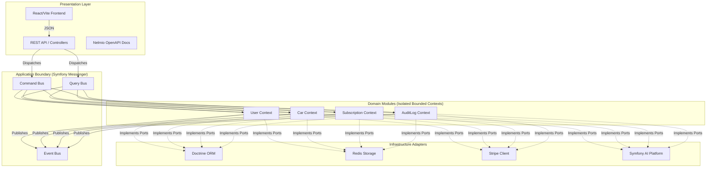
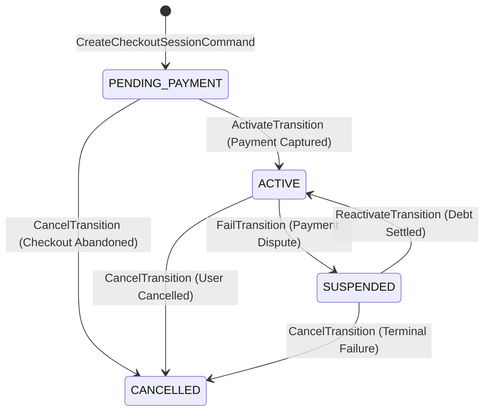
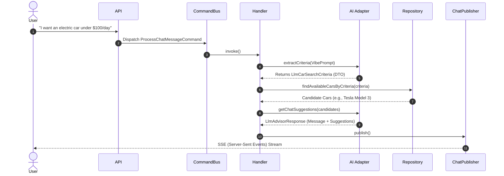

# DriveAgency

[](https://www.php.net/)
[](https://symfony.com/)
[](https://react.dev/)
[](https://www.typescriptlang.org/)
[](https://www.postgresql.org/)

DriveAgency is a car subscription platform built with PHP and React. It serves as a practical example of integrating complex backend domain logic with a responsive frontend.

The system handles workflows like concurrency control during vehicle bookings, AI-assisted chat for car recommendations, and managing subscription states across multiple services.

---

## Table of Contents
1. [Architecture Overview](#architecture-overview)
2. [Patterns Used](#patterns-used)
3. [Modules](#modules)
4. [Microservices Integration](#microservices-integration)
   - [Saga Pattern](#saga-pattern)
   - [Transactional Outbox](#transactional-outbox)
   - [Distributed Tracing](#distributed-tracing)
5. [How it works under the hood](#how-it-works-under-the-hood)
   - [Subscription State Machine](#subscription-state-machine)
   - [AI Fleet Advisor](#ai-fleet-advisor)
   - [Audit Logging](#audit-logging)
6. [Directory Structure](#directory-structure)
7. [Getting Started (Developer Setup)](#getting-started-developer-setup)
8. [API Documentation](#api-documentation)

---

## Architecture Overview

The backend uses a distributed architecture. It started as a modular monolith, but we recently extracted the Subscription logic into its own microservice to handle payments and billing cycles independently.

- **Domain Boundaries**: The monolith and microservices don't share databases. They communicate via APIs and events.
- **Distributed Transactions**: We handle cross-service transactions (like creating a subscription and locking a car) using the Saga pattern.
- **Outbox Pattern**: To make sure we don't lose events if the network drops, we use a transactional outbox to reliably push updates between services.
- **Tracing**: We pass `X-Trace-Id` headers around to track requests across the monolith and the subscription service.

---

## Patterns Used

The backend codebase tries to stick to Clean Architecture concepts:

* **CQRS**: 
  * Writes go through the Command Bus to mutate state.
  * Reads bypass the domain and use the Query Bus to fetch DTOs directly from the database.
* **Ports & Adapters**: Core business logic doesn't depend on Doctrine or external APIs directly. We use interfaces (Ports) and implement them in the infrastructure layer.
* **Domain Driven Design**: We use aggregate roots to protect data invariants instead of just relying on simple setters.
* **Pessimistic Locking**: When a user tries to book a car, we use `SELECT ... FOR UPDATE` to make sure two users can't book the same car at the exact same millisecond.



---

## Modules

1. **User (Monolith)**: Handles JWT authentication and basic user profiles.
2. **Car (Monolith)**: Keeps track of vehicle inventory and handles the AI-powered search.
3. **AuditLog (Monolith)**: Listens to domain events and records history logs.
4. **Subscription (Microservice)**: A standalone service handling Stripe webhooks, billing cycles, and subscription status changes.

---

## Microservices Integration

### Saga Pattern
When a user subscribes, the Subscription Service (microservice) needs to tell the Car Module (monolith) to lock the vehicle. 
- The Subscription Service creates a "Pending" subscription.
- It calls the Monolith API to lock the vehicle.
- If the local database update fails after the remote call succeeds, a compensation job runs to unlock the vehicle on the Monolith.

### Transactional Outbox
To make sure compensation requests aren't lost if the server crashes during a Saga rollback:
1. Compensation messages are saved to an `outbox_messages` table in the exact same database transaction as the failure.
2. A cron/worker (`app:process-outbox`) uses `SKIP LOCKED` to safely pick up pending messages and execute the HTTP calls to the Monolith.

### Distributed Tracing
To help debug requests:
- We generate a UUID `X-Trace-Id` on incoming requests.
- This ID gets logged by Monolog and passed along in headers to any downstream HTTP requests so we can trace the whole flow.

---

## How it works under the hood

### Subscription State Machine
To prevent invalid state changes (e.g., jumping from "Cancelled" back to "Active"), the `Subscription` entity uses dedicated Transition classes instead of generic setters.



### AI Fleet Advisor
The Car module hooks into LLMs (DeepSeek/OpenAI via Symfony AI) to parse what the user types into actual database search criteria.



### Audit Logging
When something important changes (like a subscription activating), a domain event is fired. The AuditLog module listens to these events asynchronously and saves a log entry. This keeps the auditing logic completely separate from the core business transactions.

---

## Directory Structure

Our architecture enforces isolation by defining standard layers inside every module.

```text
src/
├── Shared/                   # Shared Domain Kernel (ValueObjects, Event Interfaces)
└── {ModuleName}/             # e.g., Car, Subscription, User
    ├── Api/                  # Ports: HTTP Controllers, Serializers, DTO Requests
    ├── Application/          # Use Cases: Commands, Queries, Handlers, App Interfaces
    ├── Domain/               # Core: Entities, Value Objects, Domain Events, Exceptions
    ├── Infrastructure/       # Adapters: Doctrine Repositories, Stripe, AI Integrations
    └── Tests/                # Isolated Unit, Integration, and Functional Tests
```

---

## Getting Started (Developer Setup)

### Prerequisites
* Docker & Docker Compose
* Node.js (v20+) & npm

### Backend Setup
1. **Boot the infrastructure** (FrankenPHP, PostgreSQL, Redis):
   ```bash
   docker compose up -d --build
   ```
2. **Generate JWT keys** for authentication:
   ```bash
   docker compose exec php bin/console lexik:jwt:generate-keypair --skip-if-exists
   ```
3. **Run database migrations & load dummy data** (Creates test users and vehicles):
   ```bash
   docker compose exec php bin/console doctrine:migrations:migrate --no-interaction
   docker compose exec php bin/console doctrine:fixtures:load --no-interaction
   ```
4. **Run the test suite** (100% Coverage on core paths):
   ```bash
   docker compose exec php bin/phpunit
   ```

### Frontend Setup
```bash
cd frontend
npm install --legacy-peer-deps
npm run dev
```
Access the application at `http://localhost:5173/`.

---

## API Documentation

The REST API is documented using OpenAPI (Swagger). Once the backend is running, access the interactive API documentation at:
**`http://localhost/api/doc`**

*You can authenticate via the `/api/login` endpoint using the credentials generated by the fixtures:*
* **User**: `user@driveagency.com` / `userpassword`
* **Admin**: `admin@driveagency.com` / `adminpassword`
